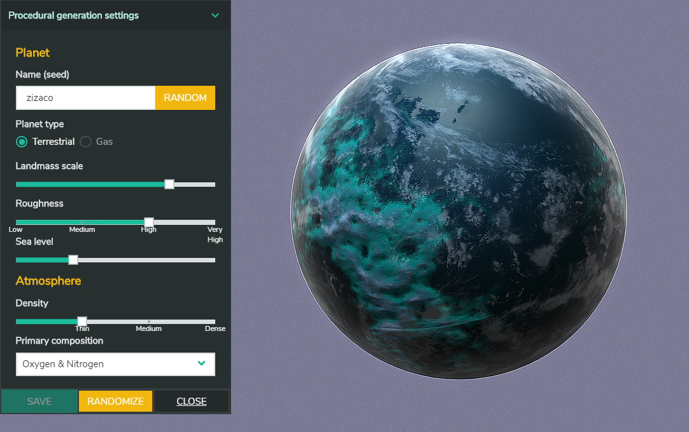
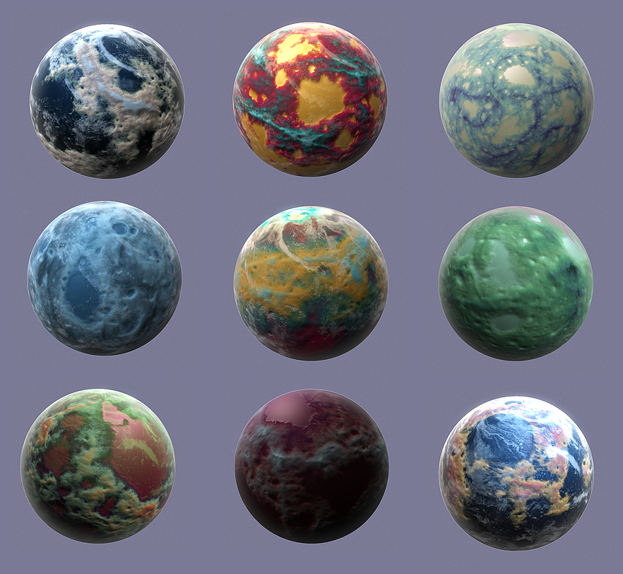
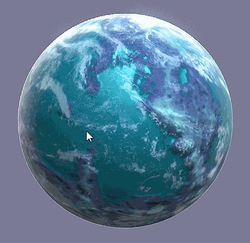

# _Yes_ Man's Sky
_A procedural planet generation tech demo_

[**Check it online** 💻🌎](https://zizaco.github.io/yesmansky)

---------------------

_"Yes Man's Sky"_ is a webgl tech demo that explores how to use simple procedural generation techniques to generate 3d planets. It's inspired by [a game of similar name](https://www.nomanssky.com/).

The demo was developed using [babylonsJS](https://babylonjs.com), Vue and typescript.

It features dynamic level of detail for the planets, mouse/touch controls and a set of parameters to generate different kind of planets. :)

## Todo

- ✅ Procedural planet generation
- ✅ User interface
- ⬜️ Eliminate artifacts in texture edges
- ⬜️ Save as url
- ⬜️ Gas giants
- ⬜️ Space and nebulas
- ⬜️ GPU (shader) based procedural textures (for better performance)
- ⬜️ Landing on planets 🥾

Thanks to:
[redblobgames](https://www.redblobgames.com/maps/terrain-from-noise/)
[SebLague](https://github.com/SebLague)

